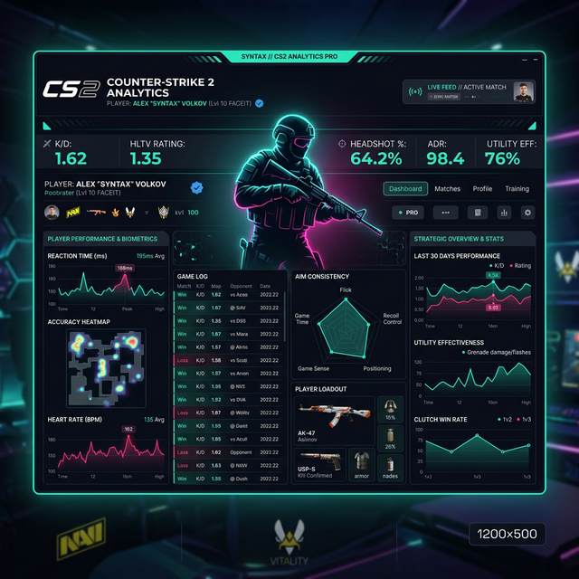

<div align="center">
  

  # 🚀 Rated.GG
  ### *The Ultimate Forensic Dossier for CS2 Players*

  [](https://opensource.org/licenses/MIT)
  [](https://nextjs.org/)
  [](https://github.com/Wxrst1/Rated.GG)

  <p align="center">
    <b>Track, Analyze, and Validate.</b><br>
    The world's most advanced Counter-Strike forensic intelligence engine, designed for high-precision profiling and competitive validation.
  </p>
</div>

<hr />

## 🔍 Overview

**Rated.GG** is more than just a stats tracker. It is a forensic intelligence platform that bridges the gap between raw match data and actionable player profiling. By integrating with Steam, Faceit, and Leetify, Rated.GG provides a **deep-dive forensic dossier** for any player, exposing metrics that standard trackers ignore.

## ✨ Key Features

- **🛡️ Forensic Dossier Extraction (DEX)**: Automated profiling of any player using Steam IDs or vanity URLs.
- **⚡ Automated Match Sync**: Real-time synchronization of match history across multiple platforms.
- **📊 Advanced Biometry & Metrics**: 
  - **Reaction Time (RT)** & **Time-to-Damage (TTD)**.
  - **Preaim Accuracy** & **Crosshair Placement (CHP)**.
  - **Wallbang & Smoke Efficiency** tracking.
- **🌟 Community Reputation Engine**: A decentralized validation system where the community can vouch for or flag players based on their in-game integrity.
- **🎯 Live Match Intelligence**: Real-time dashboard to monitor ongoing matches and opponent histories.
- **📦 Global Tracking Synergy**: Integrated links to Leetify, CSStats, Faceit, and Steam profiles.

## 🛠️ Tech Stack

Built with a performance-first architecture to handle high-frequency data ingestion and heavy forensic processing.

- **Frontend**: [React 19](https://react.dev/), [Vite](https://vitejs.dev/), [Framer Motion](https://www.framer.com/motion/), [Tailwind CSS](https://tailwindcss.com/)
- **Backend Orchestration**: [Node.js (Express)](https://expressjs.com/), [tsx](https://github.com/esbuild-kit/tsx)
- **Data Persistence**: [Supabase (PostgreSQL)](https://supabase.com/), [SQLite](https://sqlite.org/) (Local caching)
- **Task Queueing**: [Redis](https://redis.io/) + [BullMQ](https://bullmq.io/) (Forensic Demo Processing)
- **Intelligence Layer**: [Google Gemini AI](https://ai.google.dev/) (Pattern Recognition & Analysis)
- **Authentication**: [Passport.js (Steam Strategy)](https://www.passportjs.org/packages/passport-steam/)

## 🚀 Getting Started

### Prerequisites

- **Node.js**: v18.x or higher
- **Redis**: Running instance for match processing queues
- **Supabase**: Active project with the provided schema

### Local Installation

1. **Clone the repository**:
   ```bash
   git clone https://github.com/Wxrst1/Rated.GG.git
   cd Rated.GG
   ```

2. **Install dependencies**:
   ```bash
   npm install
   ```

3. **Configure Environment**:
   Create a `.env` file from the provided ` .env.example` and fill in your API keys.
   ```env
   STEAM_API_KEY=your_key
   SUPABASE_URL=your_url
   SUPABASE_ANON_KEY=your_key
   GEMINI_API_KEY=your_key
   ```

4. **Initialize Database**:
   Run the SQL scripts in `supabase_setup.sql` on your Supabase dashboard or via CLI.

5. **Start the Engine**:
   ```bash
   npm run dev
   ```

## 🤝 Contributing

We welcome forensic experts and developers to contribute to the Rated.GG engine. Please feel free to open issues or submit pull requests.

---

<p align="center">
  Developed with ❤️ by <b>Wxrst1</b>
</p>
